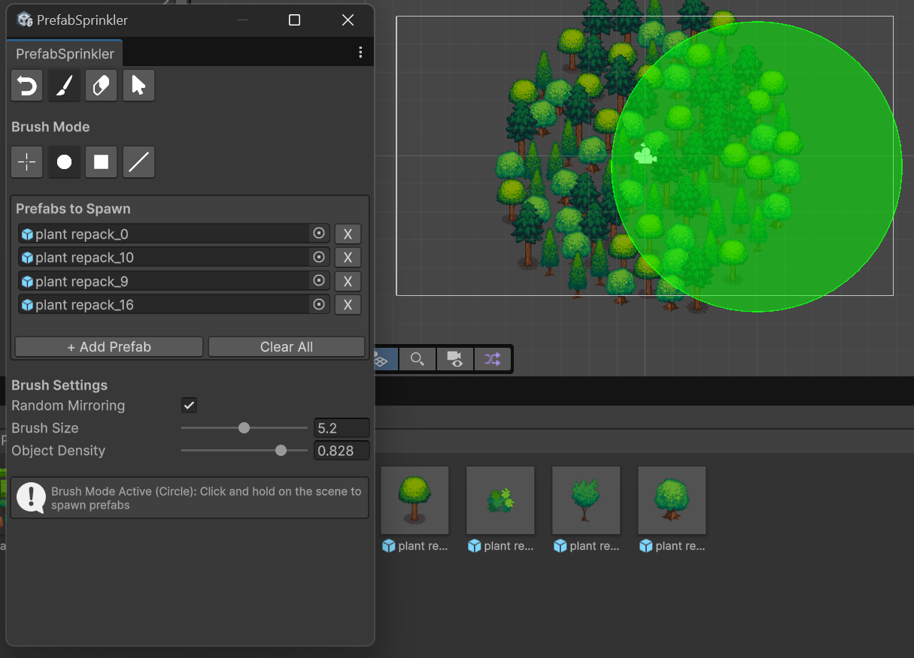

# PrefabSprinkler-for-Unity-6

Инструмент разработан для упрощения расстановки объектов по 2D карте в случайном порядке, позволяя быстро заполнить пустующие места.
 
 

## Требования

Плагин разработан для использования на Unity версии 6.0 и выше (последняя проверенная версия - 6.3)

Плагин рассчитан только на работу с 2D объектами с компонентом SpriteRenderer. 

## Работа с плагином

Плагин можно найти во владке Tools

В верхней части плагина расположены кнопка отмены последнего действия и кнопки выбора инструмента: 

* Undo - отменяет последнее действие 
* Brush - активирует режим кисти, позволяя расставлять объекты на сцене 
* Eraser - режим ластика, позволяющий убирать объекты со сцены 
* Cursor - отключает активированный режим, позволяя пользоваться обычным курсором 

Далее, под заголовком Brush Mode расположены кнопки выбора режима кисти/ластика: 

* Single - одиночная расстановка объектов 
* Circle - кисть приобретает форму круга 
* Square - кисть преобретает форму квадрата 
* Line - объекты расставляются вдоль линии 

Окно Prefabs to Spawn позволяет добавить один или несколько префабов, расстановка которых будет вестись. 
Под заколовком Brush Settings расположены настройки, отображающиеся в соответствии с выбранным инструментом и режимом: 

* Random Mirroring - в случайном порядке объекты будут отзеркаливаться 
* Brush/Eraser/Line Size/Length - размер кисти 
* Line Angle - угол поворота кисти в режиме линии 
* Object Density - плотность расстановки объектов. 

## Логика

UML диаграмма классов, отображающая логику работы плагина
 
 

## Описание основных классов системы PrefabSprinkler

### PrefabSprinkler

Главный класс системы, который наследуется от EditorWindow и координирует работу всех компонентов.

Метод OnSceneGUI является центральным обработчиком событий в окне Scene View. Отслеживает действия пользователя - нажатие кнопки мыши, удержание и отпускание. Метод использует HandleUtility.AddDefaultControl для перехвата управления от стандартных обработчиков Unity и Event.Use() для предотвращения дальнейшей обработки событий другими системами. Контроль частоты создания объектов осуществляется через сравнение текущего времени EditorApplication.timeSinceStartup с временем последнего действия.

Метод GetScenePoint решает задачу преобразования двумерных экранных координат курсора в трехмерные координаты сцены. Используется двухэтапный подход: сначала выполняется физический raycast через Physics.Raycast для поиска реальных объектов с коллайдерами, при неудаче применяется математическая проекция на виртуальную плоскость z=0. Возвращаемый nullable-тип Vector3? обеспечивает безопасную обработку случаев, когда точка пересечения не найдена.

### BrushSettings

Класс-конфигуратор, централизующий хранение всех параметров системы.

Метод GetValidPrefabs применяет LINQ-запрос FindAll(p => p != null && Is2DPrefab(p)) для фильтрации префабов. Валидными считаются только те префабы, которые содержат компонент SpriteRenderer в себе или дочерних объектах. Это реализует принцип Single Responsibility - единая точка валидации для всей системы.

* spawnRadius - радиус кисти
* objectDensity - плотность размещения (0.1-1.0)
* currentBrushShape - форма кисти (0-3)
* lineAngle - угол поворота линейной кисти
* randomFlipY - случайное отзеркаливание

### PrefabSpawner

Класс, реализующий логику создания префабов на сцене с применением различных алгоритмов размещения.

Метод SpawnMultipleObjects использует модифицированный алгоритм Poisson Disk Sampling для равномерного распределения объектов. Количество создаваемых объектов вычисляется по формуле количество = площадь × плотность × 10. Минимальное расстояние между объектами рассчитывается через линейную интерполяцию Mathf.Lerp(5f, 0.3f, плотность), что обеспечивает обратную зависимость - чем выше плотность, тем меньше минимальное расстояние. Применяется стохастическая вариация минимального расстояния через множитель Random.Range(0.7f, 1.3f), что устраняет визуальные артефакты.
Алгоритм использует итеративный подход с защитой от бесконечного цикла через ограничение maxAttempts = количество_объектов × 20. 

Метод GetExistingPrefabPositions предварительно сканирует сцену для учета уже размещенных объектов, что предотвращает наложение при повторных проходах кистью.

Метод GetRandomPosition генерирует случайные позиции внутри кисти по-разному для каждой формы:
* Circle: использует встроенный Random.insideUnitCircle, масштабированный на радиус
* Square: независимая генерация координат X и Y в диапазоне [-radius, +radius]
* Line: тригонометрическое вычисление направляющего вектора (cos(угол), sin(угол), 0) и перпендикуляра (-y, x, 0) для создания вытянутой области

### PrefabEraser

Класс, реализующий функциональность удаления префабов с применением геометрических предикатов.

Метод IsInArea содержит набор специализированных проверок принадлежности точки области для каждой формы:

* Circle: метрическая проверка Евклидово_расстояние(точка, центр) <= радиус
* Square: покоординатная проверка |X| <= радиус И |Y| <= радиус
* Line: проверка через проекцию dot(toPoint, direction) и перпендикулярное расстояние

Метод EraseObjects использует два режима работы: в режиме Single находит ближайший к центру объект через FindClosestObject и удаляет только его, в остальных режимах удаляет все объекты, попадающие в область кисти. 

Метод MatchesPrefab сопоставляет имена объектов на сцене с именами префабов из списка.

### BrushVisualizer
Класс визуализации, отвечающий за отрисовку области действия инструмента в Scene View.

Метод DrawLine конструирует замкнутый полигон из 5 вершин для представления линейной кисти. Вершины вычисляются как линейные комбинации направляющего вектора и перпендикулярного вектора, умноженного на половину ширины (0.15 единицы). Это обеспечивает точное визуальное соответствие реальной области размещения объектов.

Цветовая индикация:
* Зеленый - режим кисти
* Красный - режим ластика
* Полупрозрачная заливка Color(r, g, b, 0.3f) показывает область действия

### SprinklerUI

Класс пользовательского интерфейса, управляющий отрисовкой и взаимодействием с окном редактора.

Метод DrawPrefabList реализует валидацию префабов в реальном времени. Для каждого префаба проверяется наличие компонента SpriteRenderer в иерархии объектов. Невалидные префабы выделяются визуально через изменение GUI.backgroundColor на красноватый оттенок Color(1f, 0.5f, 0.5f). Под списком отображается предупреждение через EditorGUILayout.HelpBox с указанием количества проблемных префабов.

Метод DrawUI организует последовательную отрисовку компонентов:

* DrawToolbar() - панель режимов с визуальной индикацией активного состояния
* DrawBrushShapeButtons() - кнопки выбора формы кисти (Single/Circle/Square/Line)
* DrawPrefabList() - прокручиваемый список префабов с валидацией
* DrawBrushSettings() - динамически изменяемые настройки в зависимости от режима
* HandleHotkeys() - обработка Ctrl+Z для отмены действий

Метод LoadIcons() выполняет загрузку графических ресурсов через EditorGUIUtility.Load, создавая объекты GUIContent с иконками и текстовыми подсказками для улучшения пользовательского опыта.

 

---

В данный репозиторий загружен проект на Unity с тестовой сценой, в который включен разработанный плагин. Он находится в папке Assets/PrefabBrush. В папке плагина Prefabs уже заготовлены некоторые префабы, которые были необходимы для тестирования работоспособности плагина.

Ссылка на использованный пак: https://opengameart.org/content/lpc-plant-repack

Плагин разработан студентом РТУ МИРЭА, Панченко А. А.