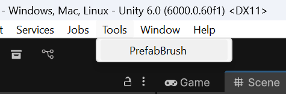
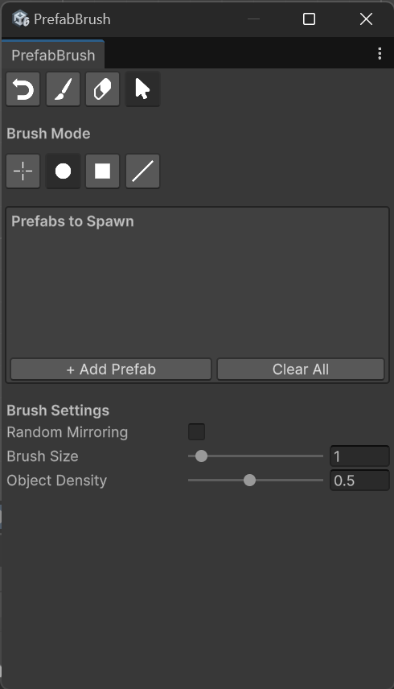

# PrefabBrush-for-Unity-6
Инструмент разработан для упрощения расстановки объектов по 2D карте в случайном порядке, позволяя быстро заполнить пустующие места.

UML диаграмма классов, отображающая логику работы плагина

Плагин можно найти во владке Tools

В верхней части плагина расположено 4 кнопки: Undo, Brush, Eraser, Cursor.
Undo - отменяет последнее действие
Brush - активирует режим кисти, позволяя расставлять объекты на сцене
Eraser - режим ластика, позволяющий убирать объекты со сцены
Cursor - отключает активированный режим, позволяя пользоваться обычным курсором
Далее, под заголовком Brush Mode расположены кнопки выбора режима кисти/ластика
Single - одиночная расстановка объектов
Circle - кисть приобретает форму круга
Square - кисть преобретает форму квадрата
Line - объекты расставляются вдоль линии
Окно Prefabs to Spawn позволяет добаавить один или несколько префабов, расстановка которых будет вестись.
Под заколовком Brush Settings расположены настройки, варьирующиеся в зависимости от выбранного инструмента и режима.
Random Mirroring - в случайном порядке объекты будут отзеркаливаться
Brush/Eraser/Line Size/Length - размер кисти
Line Angle - угол поворота кисти в режиме линии
Object Density - плотность расстановки объектов.

В данный репозиторий загружен проект на Unity с тестовой сценой, в который включен разработанный плагин. Он находится в папке Assets/PrefabBrush. В папке плагина Prefabs уже заготовлены некоторые префабы, которые были необходимы для тестирования работоспособности плагина.
Ссылка на использованный пак: https://opengameart.org/content/lpc-plant-repack

Плагин разработан студентом группы ИКБО-30-24 Панченко А.А.